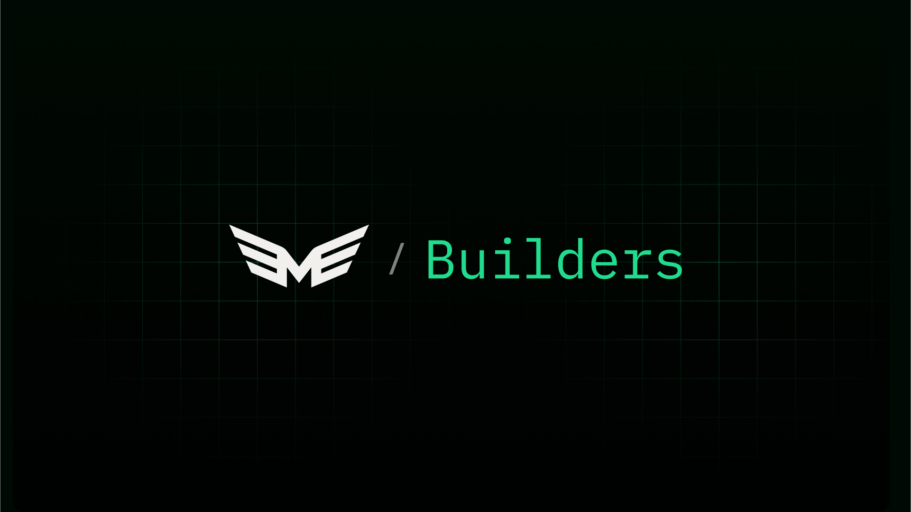

# MOR Builders



Stake MOR towards builders - Access Smart Agents, AI Models & Support The Open Source Project Of Your Choice.

## About

MOR Builders is a platform that allows you to stake MOR tokens towards builders, giving you access to Smart Agents, AI Models, and the ability to support open source projects of your choice.

## Getting Started

This project is built with [Next.js](https://nextjs.org) and bootstrapped with [`create-next-app`](https://nextjs.org/docs/app/api-reference/cli/create-next-app).

### Prerequisites

- Node.js v20.8.1 or later
- Bun package manager

### Installation

1. Clone the repository
2. Install dependencies:

```bash
bun install
```

### Running the Development Server

```bash
bun dev
```

Open [http://localhost:3000](http://localhost:3000) with your browser to see the result.

## Project Structure

The project follows the Next.js 14 app directory structure. Key directories include:

- `src/app`: Contains the main application pages and layouts
- `src/components`: Reusable React components
- `src/lib`: Utility functions and shared logic

## Technologies Used

- Next.js 14 (App Router)
- TailwindCSS
- shadcn/ui
- Bun
- TypeScript

## Learn More

To learn more about the technologies used in this project, check out the following resources:

- [Next.js Documentation](https://nextjs.org/docs)
- [TailwindCSS Documentation](https://tailwindcss.com/docs)
- [shadcn/ui Documentation](https://ui.shadcn.com)
- [Bun Documentation](https://bun.sh/docs)

## Contributing

We welcome contributions to the MOR Builders project! Please see our [Contributing Guide](CONTRIBUTING.md) for more information on how to get started.

## Deployment

This project is optimized for deployment on the [Vercel Platform](https://vercel.com). For more details, check out the [Next.js deployment documentation](https://nextjs.org/docs/app/building-your-application/deploying).